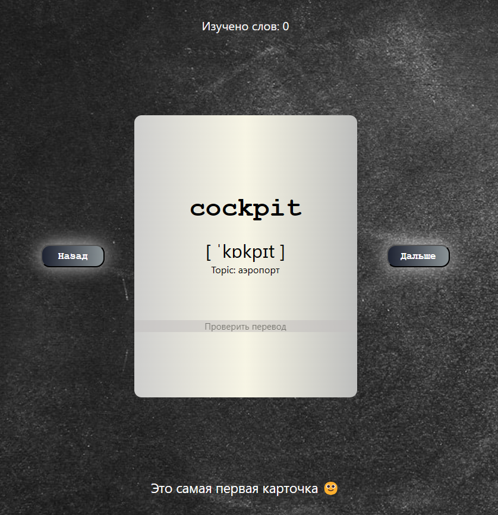

# Application for learning English using flashcards

---
## App functionality
- In this app functionality for adding, deleting and changing words in list
- The list of cards is updated when new words are added
- When changing cards, you can check your knowledge of translation by clicking on the card with the mouse

  
Main page

 
Card

   
Card with translate

